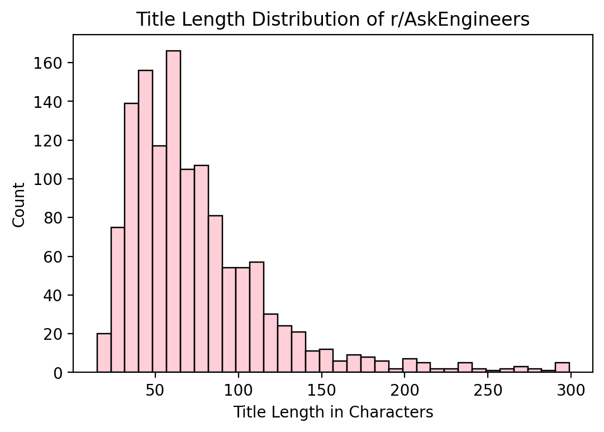
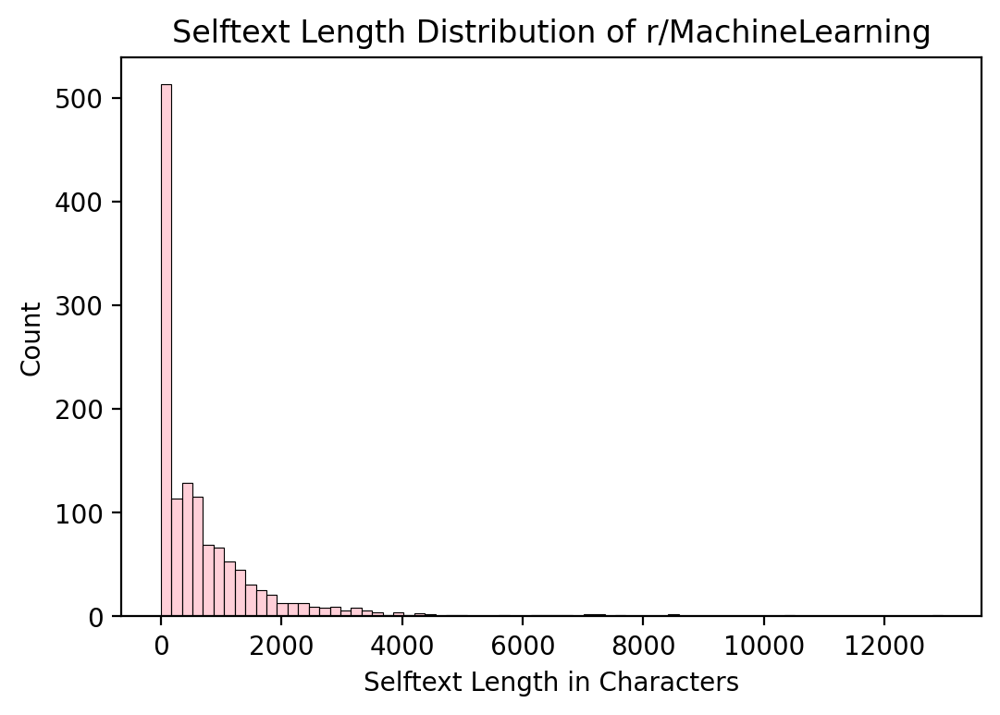

# Subreddit NLP Classification Analysis of r/AskEngineers and r/MachineLearning
---

## Introduction
&ensp;&ensp;&ensp;&ensp;In our modern world, the rate of change of life and technology continue to grow exponentially. Some previous fields of work succumb to automation and whole new fields seemingly spring into existence overnight. Possibly more interesting to me, the more knowledge we gain, some fields are becoming more generalized and ecompassing, while some are converging and being swalloed up by others. They are essentially found to have been subsets of another all along, we just didn't see the guiding throuline within until now. Machine learning is believed by some people to be one such field, that may have us rethink how many other types of computing problems can be best solved. I am curious to see here through the simple lense of global reddit discourse, how much machine learning and general engineering(by proxy with r/askengineers) are starting to converge. 

My goal is to find any significant correlations and insights in the relationship between r/AskEngineers and r/mMachineLearning in terms of the discussion and post content. I have pulled my own dataset of 1300 qualified posts from each subreddit totalling 2600 posts. Insights will be drawn from a natural language processing based model and the generalizing it has done for us as it attempts to predict which subreddit each given post came from. 

## Problem Statement
**Based on Reddit discourse, to what extent, and in which ways, are the fields of general engineering and machine learning similar?** 

#### *Questions to Explore*:
- Which words and topics are currently most shared between r/MachineLearning and r/AskEngineers?
- Which features are most distinct to r/MachineLearning?
- Which features are most distinct to r/AskEngineers?
  
---
## The Data
One data set of 2600 total posts pulled from reddit:

- [Subreddit data]('data/subreddit_data.csv')

#### Data Dictionary

There are 11 features in this data set:

|Feature|Type|Description|
|---|---|---|
|subreddit|object|parent subreddit of post|
|title|object|title of post|
|selftext|object|text body of post|
|score|int64|score of post (upvotes - downvotes)|
|num_comments|int64|number of comments on post|
|created_utc|int64|creation timestamp|
|total_text|object|title of post|
|title_length|int64|title length given in number of character|
|selftext_length|int64|selftext length given in number of character|
|title_word_count|int64|title word count|
|selftext_word_count|int64|selftext word count|

#### Data Cleaning 

Good sized data set but as it was self pulled with certain qualifications not much data cleaning and prep wsa necessary.

#### Data Cleaning Overview

- Many selftext entries were missing so a 'total text' feature was made for use in the final analysis. So some row's who had no selftext have a total text containing just their title, the rest have a total text now with both.
- Original self text column was then binarized to indicate whether the entry had selftext present.
- Of course target feature of subreddit was binarized for classification with 0 as r/AskEngineers and 1 for r/machineLearning.
- new features were made for both title and selftext length in characters as well as word count for both title and selftext.

## Key Insights and Visualizations
--- 
Many different pipelines of model types were tested and it was foud that the best performing was a gradient boost ensemble model. Along with GridSearchCV an amzing accuracy was finally reached of **98.2%!**

Here is confusion matrix representing the prediction results of the model:

We can see there were only 14 incorrect predictions out of 649 tests. We can also see that of those r/MachineLearning was incorrectly predicted as r/AskEngineers far more often than the inverse.

Here are the distributions made between word count and length for comparison:

The main insights here were that r/MachineLearning in general had far more entries that had no selftext. Other than this most distributions were quite similar for both subreddits.

Here are the top 15 most common unigrams/bigrams used in the text from both subreddits after count vectorization:

## Conclusion
In conclusion now to answer our problem statement, the fields of machine learning and general engineering do not seem to have much overlap at this point in time at least in regards to subreddit discourse. This was clear from both the final and starting accuracy of our models when assigned to the task of classification and the clear lack of overlap in terms of unigrams and bigrams used in the text.

We did still find some useful insights such as some of the most common unigrams and bigrams in each respective subreddit and, once expanded to top 50 unigrams/bigrams, we have this list of terms in common:

- 'com'
- 'https'
- 'use'
- 'new'
- 'people'
- 'think'
- 'know'
- 'time'
- 've'
- 'just'
- 'like'
- 'work'

Moving forward, as always, more data would allow us a more comprehensive and accurate model. This would be in terms of either desired priority be it better intuition or better predictions! 